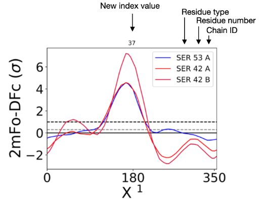

# FLEXR


`FLEXR` is a multi-conformer protein structure modeling suite.

If you use this software, please cite:

Stachowski, T. R. & Fischer, M.
[FLEXR: automated multi-conformer model building using electron-density map sampling.](https://doi.org/10.1107/S2059798323002498)
2023 Acta Cryst. D79.

Stachowski, T. R. & Fischer, M.
[FLEXR GUI: a graphical user interface for multi-conformer modeling of proteins.](https://doi.org/10.1107/S1600576724001523)
2024 J Appl Crystallogr.

## Installation

`FLEXR` was tested on an M1 Mac running macOS Sonoma 14.7 .

To run the full suite, you will need the following tools:
1. git
2. [Phenix](https://phenix-online.org), for [Ringer](https://bl831.als.lbl.gov/ringer/)
3. [Coot 1](https://pemsley.github.io/coot/) for FLEXR/FLEXR-GUI, which is most easily installed through [CCP4 9](https://www.ccp4.ac.uk/download/#os=macos)
4. [MUSCLE](https://www.drive5.com/muscle/) For FLEXR-MSA, which is most easily accessed with Phenix
5. [PyMOL](https://pymol.org) For FLEXR-MSA, optional.

These installation instructions will show you how to install FLEXR within Coot 1 from a CCP49 installation.
This will give you access to the [FLEXR-GUI](https://github.com/TheFischerLab/FLEXR-GUI)

1. Install the dependencies list above. Importantly, `muscle` and `phenix` must be accessible in your path.

2. Clone the latest release of FLEXR:
```
git clone https://github.com/TheFischerLab/FLEXR.git
```
3. Force install required python packages to Coot 1's python
```
sudo /Applications/ccp4-9/coot_py3/Frameworks/Python.framework/Versions/3.9/bin/python3.9 -m pip install pandas numpy scipy matplotlib matplotlib-venn biopython
```
4. Copy the the contents of `FLEXR` to where Coot 1 can see it:
```
cp ./FLEXR/* /Applications/ccp4-9/coot_py3/Frameworks/Python.framework/Versions/3.9/lib/python3.9/site-packages/coot
```
5. Coot 1 with the FLEXR-GUI loaded can be launched with:
```
/Applications/ccp4-9/coot_py3/bin/coot --script /Applications/ccp4-9/coot_py3/Frameworks/Python.framework/Versions/3.9/lib/python3.9/site-packages/coot/flexr_extentions.py
```
6. Optionally, an alias can be setup (in `~/.bash_profile` for example) to make life easier:
```
alias coot1flexr='/Applications/ccp4-9/coot_py3/bin/coot --script /Applications/ccp4-9/coot_py3/Frameworks/Python.framework/Versions/3.9/lib/python3.9/site-packages/coot/flexr_extentions.py'
```
or
```
alias flexr='/Applications/ccp4-9/coot_py3/Frameworks/Python.framework/Versions/3.9/bin/python3.9 /Applications/ccp4-9/coot_py3/Frameworks/Python.framework/Versions/3.9/lib/python3.9/site-packages/coot/flexr.py'
```

## FLEXR usage

FLEXR is a multi-conformer modeling tool.
It will detect alternative conformations of side-chains from an electron density map and explicitly add them to the model.

1. Instructions on running FLEXR through the GUI are found [here](https://github.com/TheFischerLab/FLEXR-GUI)

2. Through the command line starting from a `PDB` and `MTZ` file:
```
  phenix.pdbtools somepdb.pdb remove_alt_confs=True                                     # 1. Remove alt conformations present in the input model
  phenix.maps somepdb_modified.pdb somepdb.mtz                                          # 2. Generate map coefficients
  mmtbx.ringer somepdb_modified.pdb somepdb_modified_map_coeffs.mtz                     # 3. Calculate electron density measurements
  flexr -f somepdb_modified_ringer.csv -pdb somepdb_modified.pdb -build True            # 4. Run FLEXR multi-conformer modeling building
```
3. Outputs:
```
  somepdb_modified_flexr.pdb                                    # 1. FLEXR multi-conf model
  peak_finder_output_0.3_somepdb_modified_flexr_modified_ringer # 2. Raw peak finding results
  somepdb_modified_ringer_0.3_alts.csv                          # 3. list of alternative conformers found and added to the model
```
4. Some relevant options for `flexr`:
```
  -g GEOTOLERANCE - Tolerance for match between measured chi and ideal chi in library for FLEXR. Default = 30
  -t SIGMATHRESHOLD - Sigma threshold for peak finding in FLEXR/FLEXRSCORE. Default = 0.3
  -p PLOT - Save individual plots showing peak finding results? This is slow. Default = False
  -l BUILD_LIMIT - Limit the number of rotamers FLEXR will build per residue. Default: 3
  -branching BRANCHING - where do you want alt confs to branch in model? "CA" or "ALL". Default: "CA"
```
5. Options that are in beta testing:
```
  -clashscore CLASHSCORE - Skip alt confs for building that clash. Default: False
  -densityscore DENSITYSCORE - Skip alt confs for building that have weak density. Default: False
  -sconfs SINGLECONFS - Evaluluate and build single conformers detected by FLEXR. Default = False
```

## FLEXR-MSA usage

`FLEXR-MSA` is a tool that compares Ringer profiles from proteins with non-identical sequences.
In other words, it is useful for comparing the dynamics of closely related, but not necessarily identical, proteins.

1. To run `FLEXR-MSA`, simply run:
```
flexr -m MSA
```
and it will find all `_ringer.csv` files in the working directory.

2. Outputs
```
ringer_alignment.fasta          1. Sequences from Ringer CSV files in FASTA
ringer_alignment_muscle.fasta   2. Sequence alignment from MUSCLE
alignment_new_index.csv         3. Sequence alignment with new residue numbering
final_ringer_dataframe.csv      4. All input Ringer CSV files with numbering based on alignement
somepdb_modified_chi1_out.pdb   5. Pdb with Pearson CC values in B-factor columns (if -pearson True -render True options are used)
chi1                            6. Directory with images of sequence aligned Ringer profiles
tmp                             7. Directory with Ringer CSVs separated by chain
```

3. Example sequence aligned Ringer profile


2. Some relevant options for `flexr -msa`:
```
  -safety SAFETY - compare only matched residues that are either branched or unbranched in DELTA. Default: True
  -colors COLORS - Colors to plot each model in DELTA - files are read in alphabetically.
                   Example: -colors blue,red Default: random assignment
  -pearson PEARSON - Calculate Pearson CC values in DELTA. Default: False
  -render RENDER - Add median CC value to B-factor column in first file to render in PyMOL in DELTA. Default: False
  -s STEP - Step sized used for sigma measurements in ringer.csv file.
```


